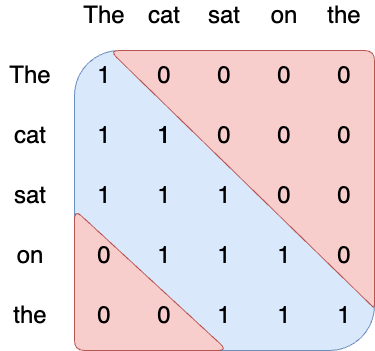
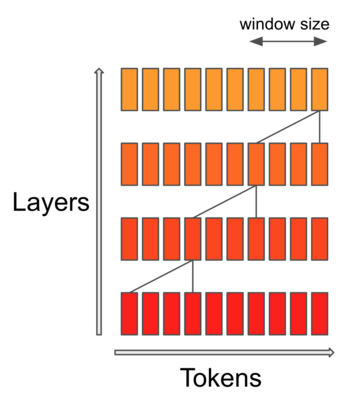
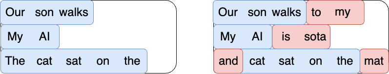
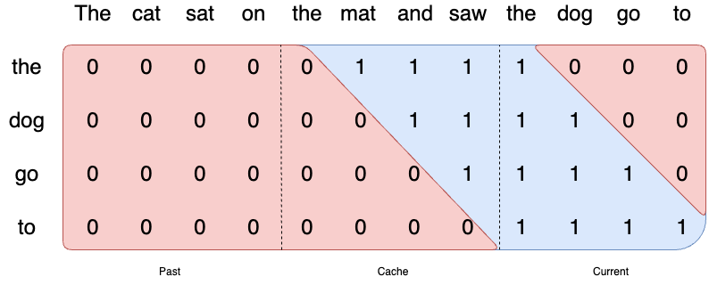
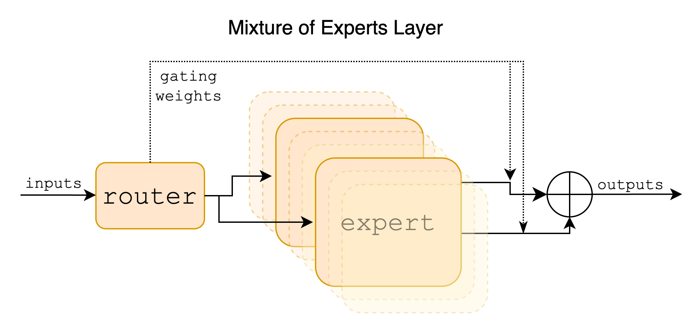

# Mistral Transformer

This repository contains minimal code to run our 7B model.

Blog: [https://mistral.ai/news/announcing-mistral-7b/](https://mistral.ai/news/announcing-mistral-7b/)\
Discord: [https://discord.com/invite/mistralai](https://discord.com/invite/mistralai)\
Documentation: [https://docs.mistral.ai/](https://docs.mistral.ai/)\
Guardrailing: [https://docs.mistral.ai/usage/guardrailing](https://docs.mistral.ai/usage/guardrailing)

## Deployment

The `deploy` folder contains code to build a [vLLM](https://github.com/vllm-project/vllm) image with the required dependencies to serve the Mistral AI model. In the image, the [transformers](https://github.com/huggingface/transformers/) library is used instead of the reference implementation. To build it:

```bash
docker build deploy --build-arg MAX_JOBS=8
```

Instructions to run the image can be found in the [official documentation](https://docs.mistral.ai/quickstart).

## Installation

```
pip install -r requirements.txt
```

## Download the model
```
wget https://models.mistralcdn.com/mistral-7b-v0-1/mistral-7B-v0.1.tar (md5sum: 37dab53973db2d56b2da0a033a15307f)
tar -xf mistral-7B-v0.1.tar
```

## Run the model

```
python -m main demo /path/to/mistral-7B-v0.1/
# To give your own prompts
python -m main interactive /path/to/mistral-7B-v0.1/
```
Change `temperature` or `max_tokens` using:
```
python -m main interactive /path/to/mistral-7B-v0.1/ --max_tokens 256 --temperature 1.0
```

If you want a self-contained implementation, look at `one_file_ref.py`, or run it with 
```
python -m one_file_ref /path/to/mistral-7B-v0.1/

This is a test of the emergency broadcast system. This is only a test.

If this were a real emergency, you would be told what to do.

This is a test
=====================
This is another test of the new blogging software. I’m not sure if I’m going to keep it or not. I’m not sure if I’m going to keep
=====================
This is a third test, mistral AI is very good at testing. 🙂

This is a third test, mistral AI is very good at testing. 🙂

This
=====================
```

To run logits equivalence through chunking and sliding window, launch
```
python -m test_generate
```

### Running large models

When running models that are too large to fit a single GPU's memory, use pipeline parallelism (PP) and `torchrun`. This is needed to run `Mixtral-7B-8x`. The code below does 2-way PP.

```
torchrun --nproc-per-node 2 -m main demo /path/to/mixtral-7B-8x-v0.1/ --num_pipeline_ranks=2
```

> [!Note]
> PP is not supported when running in interactive mode.

# Sliding window attention

## Vanilla attention

Attention is how information is shared between tokens in a sequence.
In vanilla transformers, attention follows a causal mask: each token in the sequence can attend to itself and all the tokens in the past.
This ensures that the model is causal, i.e. it can only use information from the past to predict the future.


## Sliding window to speed-up inference and reduce memory pressure

The number of operations of attention is quadratic in the sequence length, and the memory pressure is linear in the sequence length.
At inference time, this incurs higher latency and smaller throughput due to reduced cache availability.
To alleviate this issue, we use a sliding window attention [1,2]: each token can attend to at most W tokens in the past (here, W=3).



Note that tokens outside the sliding window still influence next word prediction. 
At each attention layer, information can move forward by W tokens at most: after two attention layers, information can move forward by 2W tokens, etc.
For instance in a sequence of length 16K and a sliding window of 4K, after 4 layers, information has propagated to the full sequence length.



Empirically, we see that longer contexts do help *even outside the sliding window* but when the sequence length becomes too large, the model does not use the full context anymore.

## Rolling buffer cache

We implement a rolling buffer cache.
The cache has a fixed size of W, and we store the (key, value) for position i in cache position i % W.
When the position i is larger than W, past values in the cache are overwritten.



## Pre-fill and chunking

When generating a sequence, we need to predict tokens one-by-one, as each token is conditioned on the previous ones.
However, the prompt is known in advance, and we can pre-fill the (k, v) cache with the prompt.
If the prompt is very large, we can chunk it into smaller pieces, and pre-fill the cache with each chunk.
For this we can choose as chunk size the window size. For each chunk, we thus need to compute the attention over the cache and over the chunk.




# Sparse Mixture of Experts (SMoE)

Sparse Mixture of Experts allows one to decouple throughput from memory costs by only activating subsets of the overall model for each token. In this approach, each token is assigned to one or more "experts" -- a separate set of weights -- and only processed by sunch experts. This division happens at feedforward layers of the model. The expert models specialize in different aspects of the data, allowing them to capture complex patterns and make more accurate predictions.



## Pipeline Parallelism

Pipeline parallelism is a set of techniques for partitioning models, enabling the distribution of a large model across multiple GPUs. We provide a simple implementation of pipeline parallelism, which allows our larger models to be executed within the memory constraints of modern GPUs. Note that this implementation favours simplicity over throughput efficiency, and most notabably does not include microbatching.


## Integrations and related projects

### Model platforms

- Use Mistral 7B Instruct on [Mistral AI official API](https://console.mistral.ai/) (La Plateforme)
- Use Mistral AI in HuggingFace:
  - [Mistral-7B-v0.1](https://huggingface.co/mistralai/Mistral-7B-v0.1)
  - [Mistral-7B-Instruct-v0.1](https://huggingface.co/mistralai/Mistral-7B-Instruct-v0.1)
- Use Mistral 7B on [Vertex AI](https://github.com/GoogleCloudPlatform/vertex-ai-samples/blob/main/notebooks/community/model_garden/model_garden_pytorch_mistral.ipynb)
- Use Mistral 7B on [Replicate](https://replicate.com/lucataco/mistral-7b-v0.1)
- Use Mistral 7B on [Sagemaker Jumpstart](https://aws.amazon.com/blogs/machine-learning/mistral-7b-foundation-models-from-mistral-ai-are-now-available-in-amazon-sagemaker-jumpstart/)
- Use Mistral 7B on [Baseten](https://app.baseten.co/explore/)

### Applications

- Compare Mistral 7B to Llama 13B on [LLMBoxing](https://llmboxing.com/)
- Compare Mistral 7B to 10+ LLMs on [Chatbot Arena](https://chat.lmsys.org/) or host it yourself with [FastChat](https://github.com/lm-sys/FastChat) 
- Use Mistral 7B in [Dust](https://dust.tt/)
- Speak to Mistral AI Instruct on [Perplexity labs](https://labs.perplexity.ai/) (warning: deployed version is not [guardrailed](https://docs.mistral.ai/usage/guardrailing)) 
- Use Mistral 7B in [Quivr](https://blog.quivr.app/is-mistral-a-good-replacement-for-openai/)
- Use Mistral 7B or its Zephyr derivate on [LlamaIndex](https://docs.llamaindex.ai/en/stable/core_modules/model_modules/llms/root.html#open-source-llms)

### Local deployment
- [Ollama](https://ollama.ai/library/mistral) local deployment
- [GGML](https://github.com/ggerganov/ggml) local deployment
- [TextSynth](https://textsynth.com/pricing.html) local deployment

### Derived models

- Multimodal: [BakLLaVa-1](https://huggingface.co/SkunkworksAI/BakLLaVA-1)

- Model fine-tuned on direct preferences: [Zephyr-7B-alpha](https://huggingface.co/HuggingFaceH4/zephyr-7b-alpha)

- Model fine-tuned on generated data: [OpenOrca](https://huggingface.co/Open-Orca/Mistral-7B-OpenOrca)


## References

[1] [Generating Long Sequences with Sparse Transformers, Child et al. 2019](https://arxiv.org/pdf/1904.10509.pdf)

[2] [Longformer: The Long-Document Transformer, Beltagy et al. 2020](https://arxiv.org/pdf/2004.05150v2.pdf)
